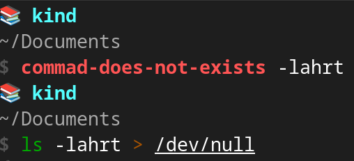
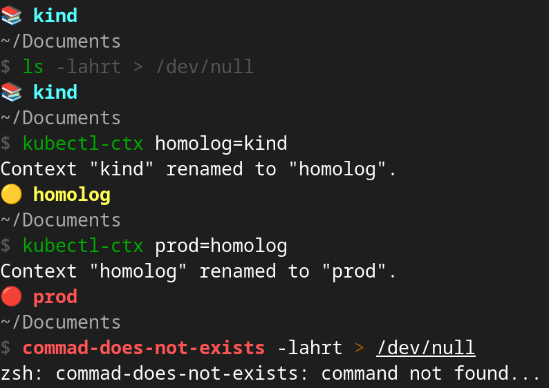

*__Blog Post Publish Date:__ 2024/02/08*

---

# ZSH + Starship: A Productivity Masterpiece

This blog post covers my prompt customization experience, my favorites [ZSH](https://www.zsh.org/) Plugins, [options](https://zsh.sourceforge.io/Doc/Release/Options.html), and my [Starship](https://starship.rs/) configuration. Finally, I introduce a simple guide to configure my setup from scratch.

## My Prompts Customization Experiences

Productivity is a topic that I definitely like. I always look better ways to execute the bored daily tasks, mainly in my terminal. For long time, I used the raw terminal over Bash, It is force me to memorize the commands, but the productivity is not so good. I felt the necessity in the new shell adoption, focused in productivity.

Because my Python expertise, I tested the [xonsh](https://xon.sh/) as my primary shell. The [xonsh](https://xon.sh/)is a superset of Python with additional shell primitives that you are used to from Bash. The union Bash + Python is funny, but is a chaos to debug (_Imagine a list comprehension with dicts and environments variables in bash syntax..._).

I needed come back the real world again, then I gave a chance for [ZSH](https://www.zsh.org/), which brings the productivity with several plugins, and the syntax almost the same the Bash. I really liked it, mainly when I tested the [Spaceship](https://github.com/spaceship-prompt/spaceship-prompt) (_"minimalistic, powerful and extremely customizable Zsh prompt"_), and the framework [oh-my-zsh](https://ohmyz.sh/), which makes simple installation and tests new plugins. I believed I had reached a stable terminal configuration with a good balance between productivity and simplicity, but in the MacOs workstation, the delay of the commands got on my nerves.

I read some articles and see Youtube videos about how to improve the performance of the ZSH + Spaceship + oh-my-zsh, but the result don't satisfied myself. Then, I opted to install the Plugins manually avoiding the [oh-my-zsh] Framework, and I tested the [Starship](https://starship.rs/), in my words, is the "_[Spaceship](https://github.com/spaceship-prompt/spaceship-prompt) alternative in Rust, blazing-fast, with many stars in the GitHub_". The results blew my mind. I had no efforts to rewrite my plugins customizations from the [Spaceship](https://github.com/spaceship-prompt/spaceship-prompt) to [Starship](https://starship.rs/), and the performance really works a expected.

## My ZSH Favorite Plugins

There are so many plugins for ZSH which extends the basic functionality. Usually, these plugins it is managed [oh-my-zsh](https://ohmyz.sh/), a framework to make simple the ZSH customization. Normally, these plugins are single zsh scripts files with predefined set of the functions and routines. I used [oh-my-zsh](https://ohmyz.sh/) to make easy the Plugins world exploration. When I found the Plugins that make sense for me, I installed my favorite plugins standalone, download the source code directly without intermediate. It can removed a unnecessary workload in my Terminal boot, a possible step to delay.

I will introduce in the following sub-topics, my indispensable ZSH Plugins.

> _I only used the plugin that really make the difference in my work. Thus, don't feel strange about the low number._

### `zsh-autosuggestions`: Commands Recall Assistant

No doubts, this is my favorite Plugin. This Plugin suggests command completion based on history. It is really cool.


> <i class="fa-solid fa-link"></i> More Details: <https://github.com/zsh-users/zsh-autosuggestions>

### `zsh-syntax-highlighting`: Valid Commands by Color

This Plugin help you fix the typo in the commands. In real time, when command is correctly typed, the color is green, otherwise, the color is red.



> <i class="fa-solid fa-link"></i> More Details: <https://github.com/zsh-users/zsh-syntax-highlighting/blob/master/>

### `kubectl`: k alias for kubectl

This plugin adds completion for the Kubernetes cluster manager, as well as some aliases for common kubectl commands.

For example:
- `$ kubectl get pods` is `$ kgp`
- `$ kubectl delete cm foobar-config-map` is `$ kdelcm foobar-config-map`
- `$ kubectl get cronjob` is `$ kubectl get cj`

> <i class="fa-solid fa-link"></i> More Details: <https://github.com/ohmyzsh/ohmyzsh/tree/master/plugins/kubectl>

## My Starship Configuration

The simplicity is elegance. I customize my Starship prompt with only attributes that I really are important for me.

- [aws](https://starship.rs/config/#aws): Only the profile name of the my AWS session.
- [git](https://starship.rs/config/#git-branch): Only the Branch, no more info.
- [python](https://starship.rs/config/#python): The current activated virtualenv parent directory indicator.
- [kubernetes](https://starship.rs/config/#kubernetes): The Kubernetes context name. Based on Kubernetes context name, I applied the diffents style to explicit the differences in the study, tests, and production workloads.

## My favorite ZSH options (_setopt_)

Some behaviors in the ZSH can be enabled based on list of the [ZSH Options](https://zsh.sourceforge.io/Doc/Release/Options.html). There are my options that I enabled in my setup.

- `INTERACTIVE_COMMENTS`: Enable comments "#" expressions in the prompt shell;
- `APPEND_HISTORY`: Append new history entries to the history file;
- `INC_APPEND_HISTORY`: Save each command to the history file as soon as it is executed;
- `HIST_IGNORE_DUPS`: Ignore recording duplicate consecutive commands in the history;
- `HIST_IGNORE_SPACE`: Ignore commands that start with a space in the history;
- `SHARE_HISTORY`: Share the command history among multiple ZSH sessions.

> <i class="fa-solid fa-link"></i> More Details: <https://zsh.sourceforge.io/Doc/Release/Options.html>

## How to Setup My ZSH From Scratch

- `1`: Install the [ZSH](https://www.zsh.org/) with your package manage.

```{code-block} bash
# if fedora
$ dnf install zsh

# if macos
$ brew install zsh
```

- `2`: Install the [Starship](https://starship.rs/):

```{code-block} bash
$ curl -sS https://starship.rs/install.sh | sh
```

- `3`: Create a directory in your home to save the ZSH plugins and the Starship configuration:

```{code-block} bash
$ mkdir $HOME/.config
$ mkdir $HOME/.my-custom-zsh/
```

- `4`: Download my custom starship configuration:

```{code-block} bash
$ curl -XGET https://raw.githubusercontent.com/c-neto/ansible-configure-fedora/main/files/dotfiles/starship.toml $HOME/.config/starship.toml
```

- `5`: Install the plugins manually:

```{code-block} bash
# k alias
$ curl -XGET https://raw.githubusercontent.com/ohmyzsh/ohmyzsh/master/plugins/kubectl/kubectl.plugin.zsh > $HOME/.my-custom-zsh/kubectl.plugin.zsh

# zsh-syntax-highlighting
$ git clone --depth 1 https://github.com/zsh-users/zsh-syntax-highlighting.git ~/.my-custom-zsh/zsh-syntax-highlighting

# zsh-autosuggestions
$ git clone --depth 1 https://github.com/zsh-users/zsh-autosuggestions ~/.my-custom-zsh/zsh-autosuggestions
```

- `6`: Restart your terminal, the results will be like this:



## Conclusion (Author Opinion)

Productivity is a dynamic goal. Utilize tools that meet your current needs, and continually enhance processes based on demands. Currently, for my DevOps routine, the combination of ZSH and Starship proves to be a balanced approach, offering a blend of performance, simplicity, productivity, and extendability.

## Links

- <https://github.com/c-neto/ansible-configure-fedora/tree/main/files/dotfiles>
- <https://github.com/ohmyzsh/ohmyzsh/tree/master/plugins/kubectl>
- <https://github.com/spaceship-prompt/spaceship-prompt>
- <https://github.com/zsh-users/zsh-autosuggestions>
- <https://github.com/zsh-users/zsh-syntax-highlighting.git>
- <https://github.com/zsh-users/zsh-syntax-highlighting/blob/master/>
- <https://ohmyz.sh/>
- <https://raw.githubusercontent.com/c-neto/ansible-configure-fedora/main/files/dotfiles/starship.toml>
- <https://raw.githubusercontent.com/ohmyzsh/ohmyzsh/master/plugins/kubectl/kubectl.plugin.zsh>
- <https://starship.rs/>
- <https://www.zsh.org/>
- <https://xon.sh/>
- <https://zsh.sourceforge.io/Doc/Release/Options.html>
